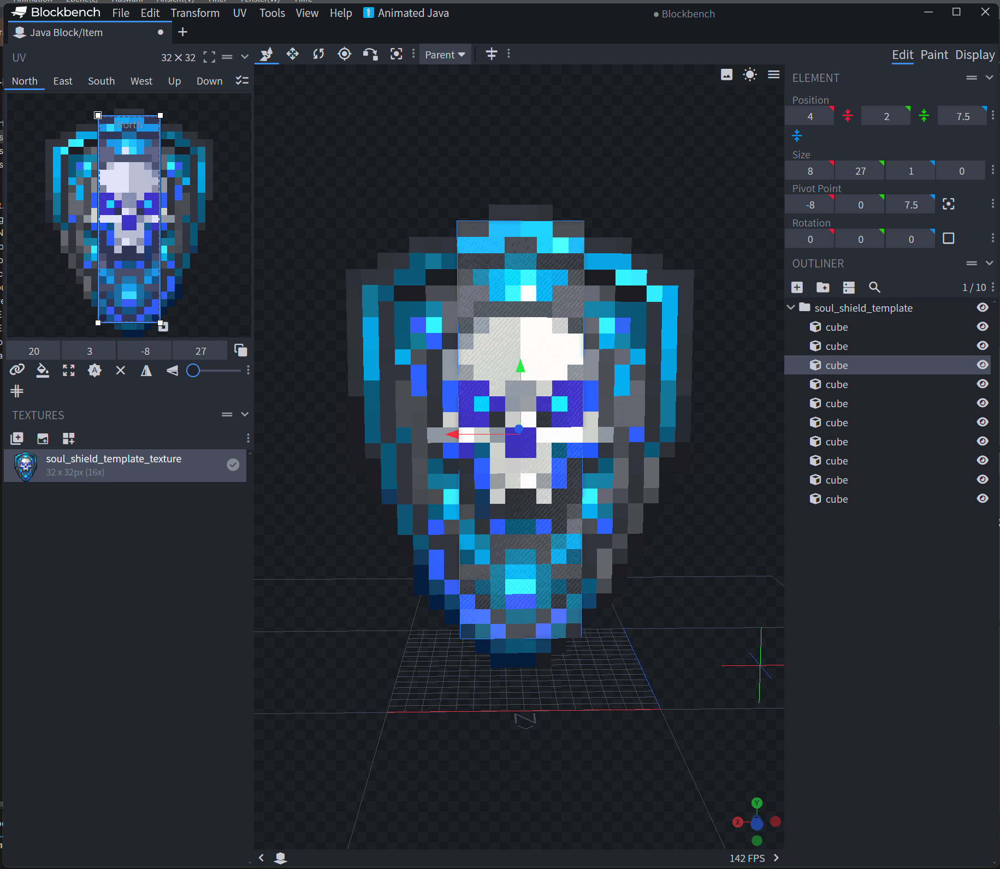
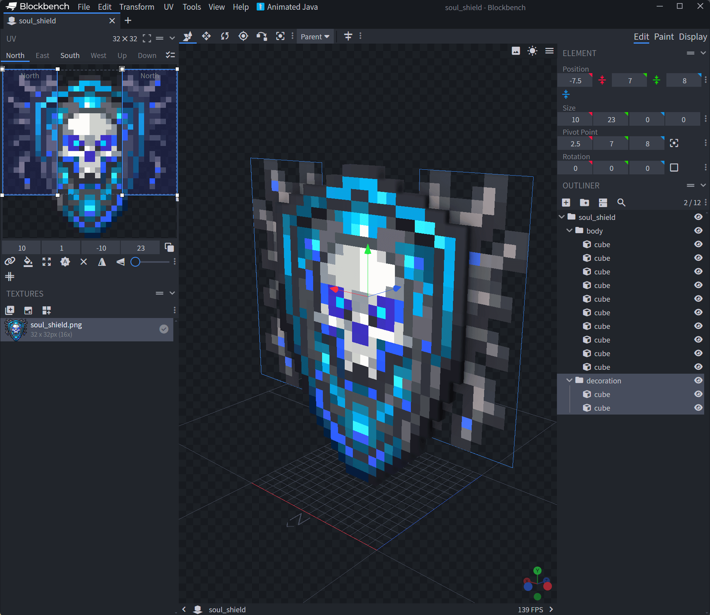
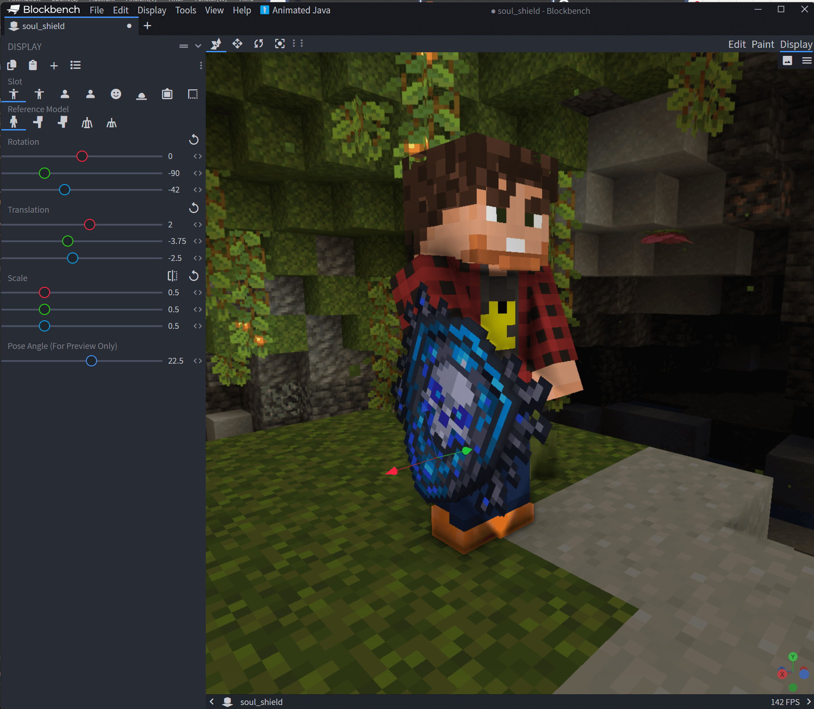

# 🎨 Minecraft Image to Blocks Plugin

This [Blockbench](blockbench) plugin lets you **transform images into blocks**!
Whether you're crafting an intricate design or just starting with a base model,
this plugin simplifies the process by converting any image into block structures. 📸➡️🧱

## 🚀 How to Use

Easily turn images into block models, perfect for **initial layouts** or **detailed designs**.
Typically, you'd begin by creating a basic block layout, then fine-tune it into your final Minecraft
model.

### 🖼️ Breaking Down Your Image into Layers

For the best results, try breaking your image into **different layers**.
Let's say you're working with an image of a shield.

The **Layer breakdown** might look like this:

- **Layer 1**: The core shape of the shield.

  

- **Layer 2**: Decorative elements, such as symbols or patterns.

  

### 🛠️ Creating the Model

Once you've layered your image, you're ready to generate the **base model**. Follow these steps:

1. **Create a new "Java Block/Item"** model.
2. Navigate to **File → Import → Import Image to Blocks Model**.
3. Select your image file.

After the image is processed, it will convert into blocks. 🎨✨ Your result should look something like
this:

Now you can adjust and modify the blocks to refine your model!

### ✨ Adding Details and Decorations

In this example, I added a few extra blocks to finalize the model with some additional texture. 🌟

Notice that I used the **original texture** for the final look, rather than the individual layers.
Layers are primarily useful for structuring your model's base.

### 🎯 Finalizing the Model

In this case, the final model consists of only **12 blocks**. Be sure to adjust the **position** and
**size** of each block for optimal display in-game.

Here’s how it might look in Minecraft:

## ⚙️ Import Options

This plugin offers a variety of options to customize your block model. **Default settings** work
well for most cases, but here’s what you can tweak:

- **Image**: Select the image file you want to convert.
- **Use Color Values for Merging**: Merge blocks with the same color (works only when "Optimize
  Blocks" is enabled).
- **Optimize Blocks**: Reduces block count by optimizing block placement and size.
- **Mapping Texture**: Automatically maps the texture onto the created blocks.

## 🧩 Tips and Tricks

- 🔧 The optimization algorithm is quite powerful, but **manual adjustments** can further improve
  results.
- 🚀 Consider using the "Optimize" plugin to reduce the number of **rendered faces** on the final
  model, this improves in-game performance.
- 🎯 **Keep it simple**! If your texture is too complex, break it into smaller parts to avoid
  performance issues.
- 🖼️ You can import **multiple images** to create more complex models, but be cautious—this can
  increase the number of blocks and faces, which could affect performance.

With these steps, you'll have a beautiful, efficient model in no time! Happy building! 🎉

## 📝 Issues and Feedback

Found a bug or have suggestions? 🐛💡 Feel free to report any issues or share your feedback on the
plugin's GitHub page. Your input helps make the plugin even better! 🚀

[blockbench]: https://blockbench.net/

[issue]: https://github.com/MarkusBordihn/Blockbench-Plugin-Minecraft_Image_To_Blocks/issues